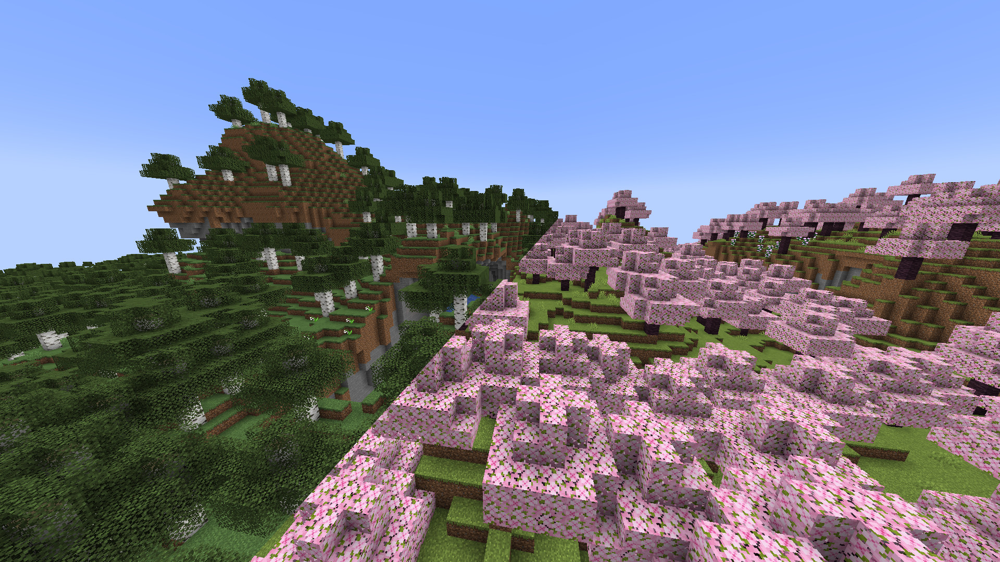

# Birch to Cherry for [Minecraft](https://minecraft.net)

> Replaces all birch textures to Cherry Blossoms from [update 1.20](https://www.minecraft.net/en-us/article/minecraft-snapshot-23w07a)

## Features

- Changes the birch forest grass to cherry grove
- Renames birch to cherry (en-us only)
- Contains an alternate leaves texture if you don't like the green leaves

## License

[MIT License](https://choosealicense.com/licenses/mit/)

